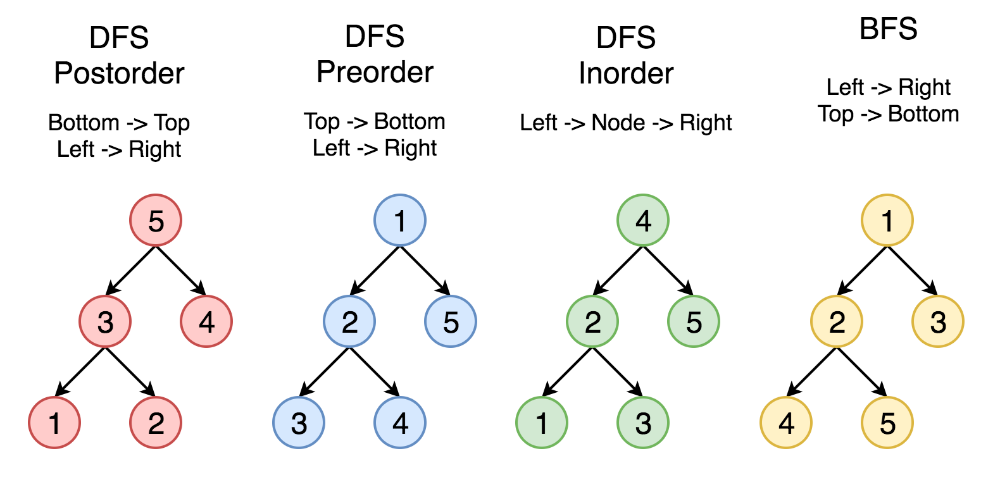

# Depth First Search(DFS)
### 깊이우선탐색

Result -> [ 1, 2, 3, 4, 5]

### DFS Postorder

Bottom -> Top
Left -> Right

최상위 루트에서부터 왼쪽 노드가 있는지 확인.
더이상 왼쪽 노드가 없으면 해당 위치에서부터 상위 루트의 오른쪽 노드로 이동.
오른쪽 노드에 하위 왼쪽 노드가 있는지 확인.
상위루트 획득.
그 상위루트의 오른쪽 노드 획득.

### DFS Preorder

Top -> Bottom
Left -> Right

### DFS Inorder

Left -> Node -> Right

### BFS

Left -> Right
Top -> Bottom
